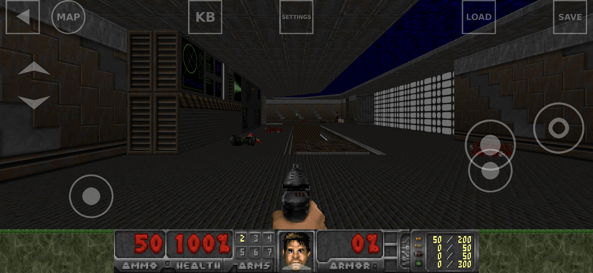
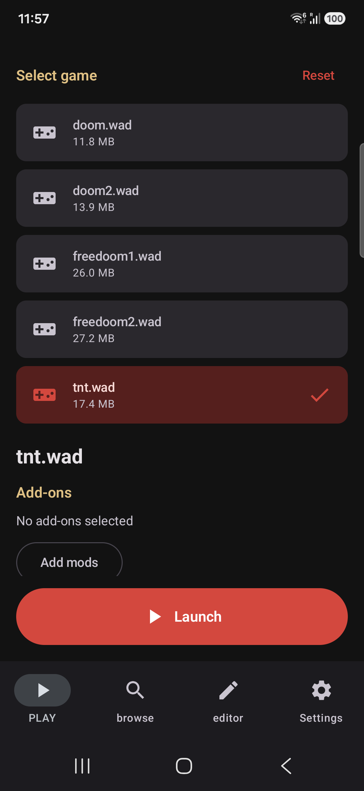
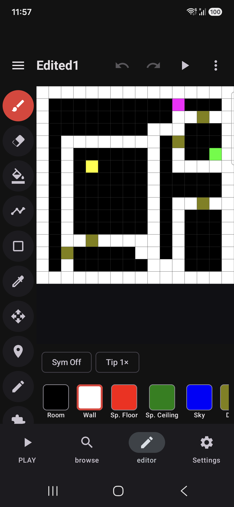
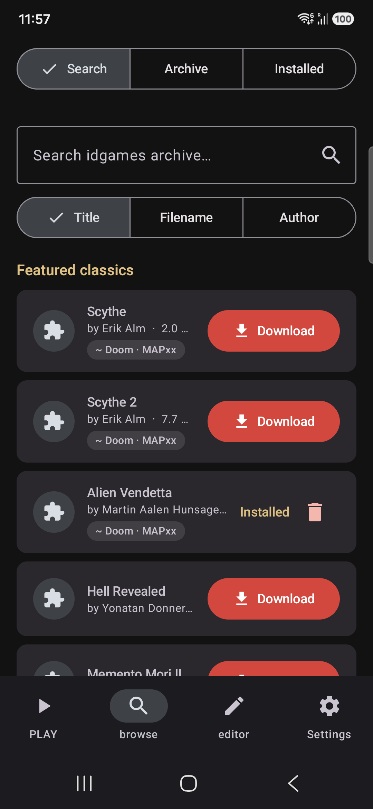

# Freedoom for Android — 2026 Modernization

</br>

*A fully open-source Doom game for modern Android — Freedoom assets + the GZDoom/UZDoom engine, with an in-app map editor and an idgames WAD browser.*

[](https://www.android.com/)
[](doom/build.gradle.kts)
[](https://github.com/emileb/gzdoom)
[](doom/src/main/jni/Application.mk)
[](#-license)

A 2026 modernization fork of mkrupczak3's / nvllsvm's **GZDoom-Android** Freedoom port,
brought back to life on current Android tooling. It bundles the open-source
[Freedoom](https://freedoom.github.io/) assets (`freedoom1.wad` / `freedoom2.wad`) with a
GZDoom-lineage engine so it runs out of the box as a completely open-source Doom game — now
building, running, and **playable on modern 64-bit Android devices**.

> The original project had stopped active development because its build tooling was deprecated
> and several of its native source dependencies were deleted from GitHub. This fork rebuilds the
> app on a maintained foundation. See [What's new in 2026](#-whats-new-in-2026) below.

## Contents

- [Overview](#overview)
- [📸 Screenshots](#-screenshots)
- [✨ What's new in 2026](#-whats-new-in-2026)
- [🚀 Building](#-building)
- [🧩 Third-party components](#-third-party-components)
- [🗺️ Roadmap](#️-roadmap)
- [❓ Why Freedoom?](#-why-freedoom)
- [🔗 Community](#-community)
- [🙏 Credits](#-credits)
- [⚖️ Disclaimer](#️-disclaimer)
- [📄 License](#-license)

## Overview

Freedoom for Android packages a maintained GZDoom-lineage engine with the open-source Freedoom
assets and a modern Kotlin/Compose launcher. Beyond just playing the bundled game, it can browse
and download thousands of community add-ons from the idgames archive and build playable levels
entirely on-device. Everything ships open-source, with no proprietary blobs.

## 📸 Screenshots

<p align="center">
  <br>
  <em>Freedoom running on a real device (Galaxy S24) — native touch controls and HUD.</em>
</p>

<p align="center">
  
  &nbsp;
  
  &nbsp;
  
</p>

<p align="center">
  <sub>Compose M3 launcher&nbsp;·&nbsp;in-app map editor&nbsp;·&nbsp;idgames WAD browser</sub>
</p>

## ✨ What's new in 2026

### 🗺️ In-app map editor

A full **Editor** tab builds playable Doom levels entirely on-device — no PC tools. Paint a level
on a colored grid (walls, rooms, doors, secrets, special floors/ceilings, sky, player start, exit),
pick a **theme** (`Tech` / `Cave` / `Hell` / `City`), then tap **Test** to boot straight into it or
**Generate WAD** to just write the file.

- **Real textures.** A texture browser reads the chosen IWAD itself (palette, `PNAMES`,
  `TEXTURE1/2` and flats, decoded to live thumbnails by a small native reader) so you can assign
  real Doom textures per surface — walls, floors, ceilings, doors, outdoor and special surfaces —
  instead of just the theme defaults.
- **Hand-placed things.** A **Thing** tool drops monsters, keys, weapons, items, ammo and
  player/co-op/deathmatch starts from a palette (with real sprite previews pulled from the IWAD);
  a **Select** tool moves, rotates, retypes or deletes any placed thing; and each thing carries
  **skill** (Easy/Med/Hard) and **Ambush** flags. Leave it on auto-populate (density sliders) for
  a quick map, or switch to manual-things for a fully hand-built one.
- **Mobile-first UI.** A persistent left **tool rail** (brush, eraser, fill, line, rect,
  eyedropper, pan, place-thing, select) with brush sizes and 4-way symmetry, a compact top bar
  (undo/redo/test + overflow), a left **drawer** (size, theme, maps, templates, textures, tuning,
  projects, share), a bottom palette, and an adaptive landscape layout. Multi-map projects
  (`MAP01…MAP32`), starter templates, named projects with crash-safe autosave, undo/redo, and
  pre-launch validation are all built in.

Under the hood the grid renders to a PNG and a bundled native converter (`libpng2wad.so`, from the
vendored [`png2wad-sdk/`](png2wad-sdk/) module) emits a **nodeless Doom-format PWAD** — now also
injecting your hand-placed things and texture choices — into `<base>/mods/`; GZDoom builds the
nodes/blockmap on load. See [`PNG2WAD_MAP_EDITOR.md`](PNG2WAD_MAP_EDITOR.md) for the tile palette,
pipeline, and the strict-lump-order fix that makes generated WADs load on this engine.

### 📥 WAD browser & downloader

A new **Browse** tab fetches add-ons straight from the Doomworld
[/idgames archive](https://www.doomworld.com/idgames/) — search by title/filename/author, see
ratings and sizes, and one-tap download (with mirror fail-over) that unzips into the add-on folder
so it shows up immediately in the launcher.

- **Featured classics** — a curated shelf (Scythe, Alien Vendetta, Hell Revealed, Requiem…).
- **Classic games** — a shelf that downloads the freely-distributable shareware/freeware IWADs
  (Doom shareware, Heretic shareware, Hexen/Strife demos, Chex Quest 1 & 3).
- **Commercial games — bring your own copy** — the still-sold games (Doom, Doom II, Final Doom,
  Heretic, Hexen, Strife) are *never* downloaded; instead you **import your own `.wad`** from a copy
  you bought via the Android file picker — the same model GZDoom uses on PC.
- **Compatibility badges** on every entry — Doom/Doom II/Heretic/Hexen/Strife/Chex plus the map-slot
  (ExMy vs MAPxx) — guessed up front from the archive path and confirmed from the upload's text file,
  so you know which IWAD a WAD needs before downloading.
- **Rich detail sheet** (fetched via the idgames `get` API): full text file, base, credits, editors,
  build time, known bugs, reviews/ratings, and a "play with" IWAD hint.
- **Archive mode** that browses the idgames file tree by category (`levels/doom2/…`) straight from
  the gamers.org mirror, in addition to keyword search.
- **`idgames://` deep links** — tapping an idgames link from a browser/forum opens the Browse tab on
  that WAD's detail sheet, ready to download.
- **Per-game download folders** — add-ons are auto-sorted into `wads/doom2/`, `wads/heretic/`, …
  based on detected compatibility, so the picker can group them by game.
- **Installed view** listing everything you've installed (add-ons + IWADs) with multi-select and
  **bulk delete** (selected or all). Individual **delete** also works from any entry, and a **Reset**
  button on the launch screen clears a stuck game/mod selection.

### 🛠️ Modern app shell

- **100% Kotlin.** All 38 Java sources converted to Kotlin (app code + the vendored libSDL and
  DragSortListView libraries), preserving the exact JNI contract with the native engine.
- **Jetpack Compose Material 3 launcher.** The whole launcher UI was rewritten in Compose with a
  dark Doom theme (blood-red / bone-amber on near-black):
  - Two-pane launch screen: WAD cards with size and selected state, big Launch button.
  - Add-ons are first-class: a bottom-sheet picker browses `wads/` / `mods/` with checkboxes
    (folders included — no more long-press), selections show as removable chips, and `.deh`/`.bex`
    patches map to `-deh` automatically. The picker shows the **selected game** in its title,
    compatibility badges per add-on, an **"only compatible"** filter, and **favorites** — star any
    WAD/mod or folder and filter to just your starred ones (persisted across sessions).
  - Command-line args field with history dropdown; Options tab with data-folder picker, resolution
    divider, in-launcher game settings (FOV/brightness/crosshair/volumes…), theme picker, and
    backup/restore; saveable per-game launch profiles.
  - First-run unpacking now shows a progress indicator (the old 10-second activity-restart hack is
    gone).
  - The in-game UI is untouched: the engine command-line contract is byte-identical (guarded by a unit
    test) and the gamepad-config screen stays View-based via Compose fragment interop.
- **Modern Android (compileSdk 36, minSdk 23).**
  - **Scoped storage** via app-specific external dirs (no `WRITE_EXTERNAL_STORAGE`).
  - `android:exported`, `WindowInsetsControllerCompat` immersive mode, `MODE_PRIVATE` prefs,
    edge-to-edge launcher with **themed system bars** (white status-bar icons; the navigation bar
    shares the bottom-navigation color).

### 🎮 Player experience & customization

The launcher now surfaces the settings players actually want, without diving into the engine's
tiny in-game touch menus:

- **In-launcher game settings.** Set field of view, brightness, crosshair, dynamic lights, vsync,
  autosave slots, an FPS counter, and master/music/SFX volumes from the Options screen. These are
  rendered to the engine command line as `+set`/`+fov` args at launch (opt-in; the byte-identical
  launch contract and its golden test are untouched — the args are composed alongside the add-on
  flags, never inside the guarded builder).
- **Compose touch-control settings.** A native Compose screen tunes on-screen opacity,
  forward/strafe/look/turn sensitivity, mouse-look, invert-look, precision shooting, the weapon
  wheel and analog sticks — writing the same prefs the engine reads on next launch.
- **Mod profiles & load order.** Save the selected IWAD + add-ons + args as a named **profile**
  (per game), and **reorder** add-ons explicitly — load order matters (gameplay mods → maps →
  HUD/texture packs).
- **Themes.** Keep the dark Doom identity, or switch to a **light** theme, **follow the system**,
  or **Material You** dynamic color (Android 12+) — applied live.
- **First-run wizard.** A short intro explains Freedoom, the idgames browser, and the controls;
  re-openable any time from Settings → *View intro again*.
- **Backup & restore.** Export your savegames and all settings to a single `.zip` (via the Storage
  Access Framework — local, SD, or a cloud folder) and restore them on another device.
- **Play statistics.** A local, account-free Statistics screen tracks total playtime, games
  launched, and last played.

### 📱 Platform & engine

- **64-bit ready.** Native libraries build for **`arm64-v8a`** *and* `armeabi-v7a`, so the app runs
  on today's 64-bit-only phones and satisfies the Google Play 64-bit requirement.
- **16 KB page support** (Android 15+): native `.so` are 16 KB `LOAD`-aligned and packaged
  uncompressed/page-aligned.
- **FMOD removed.** Audio now uses the open **OpenAL + FluidSynth** backend (this also unblocked
  arm64), so the project is fully open-source with no proprietary blobs.
- **Native engine on UZDoom 5.0.0-pre.** The engine was rebased onto GZDoom 4.15 and then swapped to
  Emile Belanger's **UZDoom 5.0.0-pre** (`uz_5.0_pre`, a maintained GZDoom fork —
  [emileb/gzdoom](https://github.com/emileb/gzdoom)), verified booting `doom2.wad` on an arm64 device
  ("UZDoom version 5.0.0-pre", base pk3s + IWAD load, OpenAL+EFX up). That brings SDL2, the modern
  GLES3 renderer, ZMusic, and **ZScript support** (most idgames releases of the last decade need
  GZDoom 4.x, so the Browse tab's downloads actually run now). The base data is rebuilt from the
  engine's `wadsrc*` trees (`uzdoom.pk3` + `uzdoom_game_support.pk3`). Builds for both ABIs with the
  current **NDK (r27)**, C++20 + abseil from the engine's own makefiles — the dead 2017 submodule tree
  and the old `build.sh`/patch-overlay system are gone.
- **AGP 9 / Gradle Kotlin DSL**, version catalog, AGP-9 built-in Kotlin — **zero build, lint, and
  manifest warnings.**

## 🚀 Building

The app is built in **two separate steps** (Gradle does not drive the native build):

```bash
# 1. Build the native engine (.so) with the NDK. Already committed under doom/src/main/libs,
#    so you only need this if you change anything under doom/src/main/jni.
ANDROID_NDK_HOME=~/Library/Android/sdk/ndk/27.0.12077973 ./build_native.sh

# 2. Build the APK (Java/Kotlin + the prebuilt .so).
./gradlew :doom:assembleDebug
```

Because the prebuilt `.so` are committed, `./gradlew :doom:assembleDebug` produces a working APK on
its own. `build_native.sh` auto-locates `ndk-build` (honours `ANDROID_NDK_HOME`), and the full native
source for the engine and its dependencies is vendored under `doom/src/main/jni/`.

### Requirements

| Tool | Version |
|---|---|
| JDK | 17 |
| Android SDK | compileSdk 36 (minSdk 23) |
| NDK | r27 (for the native build only) |

See [`CLAUDE.md`](CLAUDE.md) for the architecture and full build details.

### Rendering: confirmed on real hardware ✅

Rendering is **verified working on a real device** (Samsung Galaxy S24 / SM-S921B, Xclipse 940 GPU
via ANGLE-on-Vulkan, OpenGL ES 3.2): the launcher, the engine (UZDoom 5.0.0-pre boot, OpenAL + EFX
audio), and the full **3D game world + HUD + weapon sprites + touch controls** all render correctly,
with no crashes.

**Emulator-only limitation:** on the Android Emulator the engine boots, plays sound, and accepts
input, but the game framebuffer presents **black** (the native touch-control overlay and the engine's
own UI windows are still visible). This reproduces on both emulator GPU modes (SwiftShader and
host-GPU translation), which both run GL through a translation layer — it does **not** occur on real
hardware. Investigating the emulator present path is a low-priority follow-up.

## 🧩 Third-party components

| Component | Project | Notes |
|---|---|---|
| **Engine** | [emileb/gzdoom](https://github.com/emileb/gzdoom) `uz_5.0_pre` | UZDoom 5.0.0-pre, a mobile GZDoom fork (vendored, built with NDK r27 for armeabi-v7a + arm64-v8a). |
| **Audio** | OpenAL + [FluidSynth](https://github.com/FluidSynth/fluidsynth)-lite, mpg123, libsndfile | Emile Belanger's `AudioLibs_OpenTouch`. |
| **Input** | [emileb/MobileTouchControls](https://github.com/emileb/MobileTouchControls) | On-screen touch controls. |
| **Platform** | [SDL2](https://www.libsdl.org/) (emileb fork), [SAFFAL](https://github.com/emileb/SAFFAL) | Clibs_OpenTouch glue, ZMusic, glslang, ZWidget. |
| **Map editor** | **png2wad** (originally a C# tool by [@akaAgar](https://github.com/akaAgar/png2wad), ported to C/C++ here) | Built as `libpng2wad.so` via the `:png2wad-sdk` module — extended with hand-placed-thing injection and a native IWAD texture/flat/sprite reader for the editor's texture browser. |

## 🗺️ Roadmap

### Done ✅

- [x] Add **arm64** support (Google Play 64-bit requirement)
- [x] Switch to [emileb's MobileTouchControls](https://github.com/emileb/MobileTouchControls)
- [x] Remove the proprietary FMOD dependency (now OpenAL + FluidSynth)
- [x] 16 KB page-size support for Android 15+
- [x] Jetpack Compose Material 3 launcher UI (dark Doom theme, chip-based mod selection)
- [x] Integrate an idgames level browser/downloader (Browse tab)
- [x] Add a WAD-download feature (idgames + classic shareware/freeware games)
- [x] Import-your-own-copy flow for the commercial IWADs (Doom, Doom II, Final Doom, …)
- [x] Compatibility badges + rich detail view, archive-tree browser, `idgames://` deep links,
      per-game download folders, and an Installed view with bulk delete
- [x] Favorites in the add-on picker (star WADs/mods/folders + filter)
- [x] In-app PNG2WAD map editor (draw a grid → generate a playable map → launch it)
- [x] Editor: real IWAD textures (browse + assign per surface) and hand-placed things
      (monsters, keys, items, starts) with a Thing/Select tool and per-thing skill/ambush flags
- [x] Update SDL 1.x → SDL2 and the GL ES 1.x path → GL ES 3.x (GZDoom 4.15, `mobile_4.15.x`)
- [x] Swap the native engine to UZDoom 5.0.0-pre (`uz_5.0_pre`) — builds & runs on device
- [x] In-launcher game settings (FOV, brightness, crosshair, dynamic lights, vsync, volumes, FPS)
- [x] Compose touch-control settings; saveable per-game mod profiles with explicit load order
- [x] Light / system / Material You themes; first-run onboarding wizard
- [x] Backup & restore (savegames + settings) via the Storage Access Framework; local play stats
- [x] **Rendering verified on a real device** (Galaxy S24) — 3D world, HUD, audio and touch controls all working
- [x] Fix hardware-key crash (unbound keyboard / gamepad-Enter) — keys now route through SDL's native path

### Planned 🔜

- [ ] Vector map editor — open & edit existing WAD maps as vertices/linedefs/sectors
- [ ] Release signing keystore + config (for Play Store upload)
- [ ] Investigate the emulator-only black-screen present (low priority — real hardware is unaffected)

## ❓ Why Freedoom?

While the Doom engine and its many spin-offs are open-sourced, most of Doom's "assets" such as
textures, sounds, and game levels are copyrighted and not legal to redistribute. The Freedoom project
offers an alternative set of assets and game levels that are open-source and can be used with most
Doom engines in place of the originals. Freedoom is also compatible with much of the vast library of
fan-made "WADs" (i.e. game levels) as indexed in the idgames archive.

## 🔗 Community

[Freedoom official GitHub](https://github.com/freedoom/freedoom) ·
[Freedoom forums](https://www.doomworld.com/forum/17-freedoom/)

## 🙏 Credits

Thanks to:

- **Emile Belanger** (Beloko Games) — for the maintained, FMOD-free engine fork, the OpenTouch
  libraries (MobileTouchControls, AudioLibs, SDL, SAFFAL) this rebase is built on, and the rest of the
  OpenGames / Delta Touch suite.
- **Matthew Krupczak** (mkrupczak3) and **Andrew Rabert** (nvllsvm) — for the original GZDoom-Android /
  Freedoom-for-Android work this fork builds upon.
- The **Freedoom** authors for an excellent set of open-source assets. See
  `/doom/src/main/assets/CREDITS.txt` for the full list.
- The GZDoom / ZDoom teams and id Software for the engine lineage.

## ⚖️ Disclaimer

This project is not affiliated with Doom or its publishers, Id Software or parent companies, or
Bethesda. It is not officially endorsed by the Freedoom or GZDoom projects.

## 📄 License

Freedoom is released under a BSD-like license which can be found under
`/doom/src/main/assets/COPYING.txt`. The GZDoom engine and most other code is GPL.
